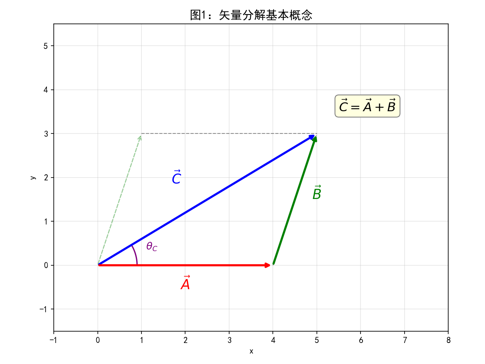
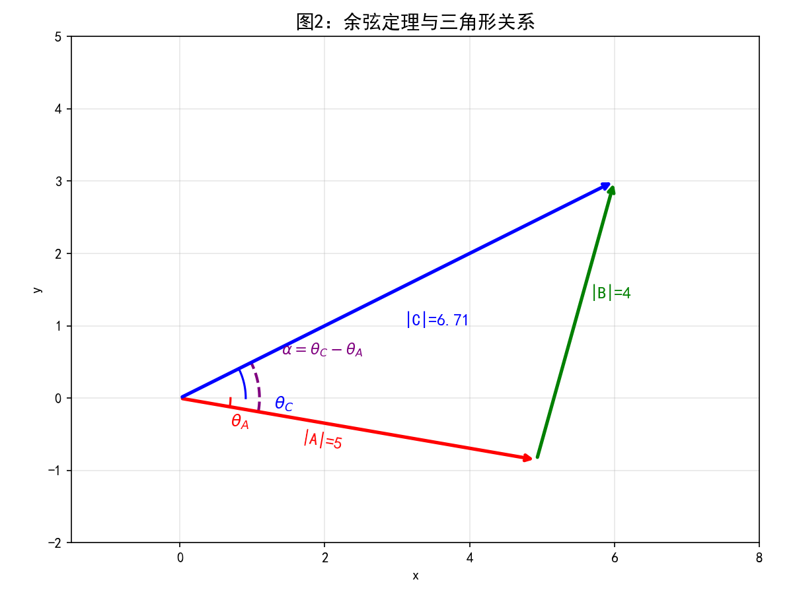
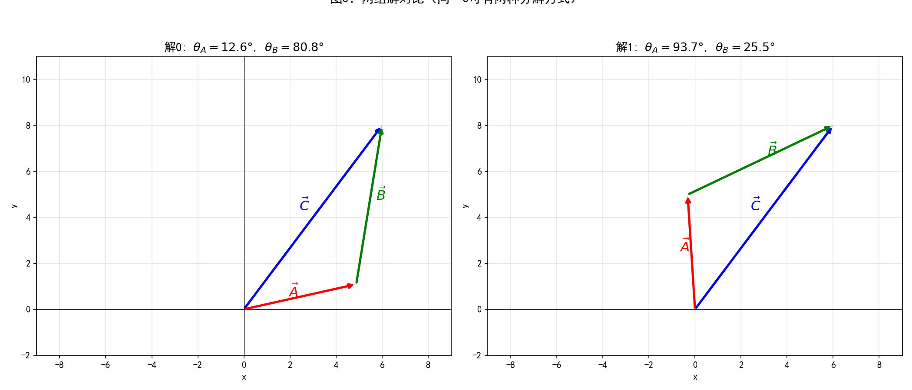
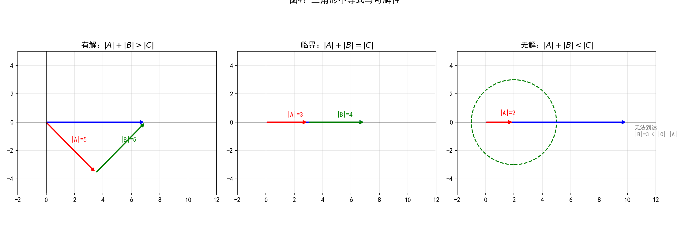
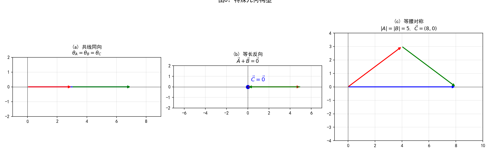
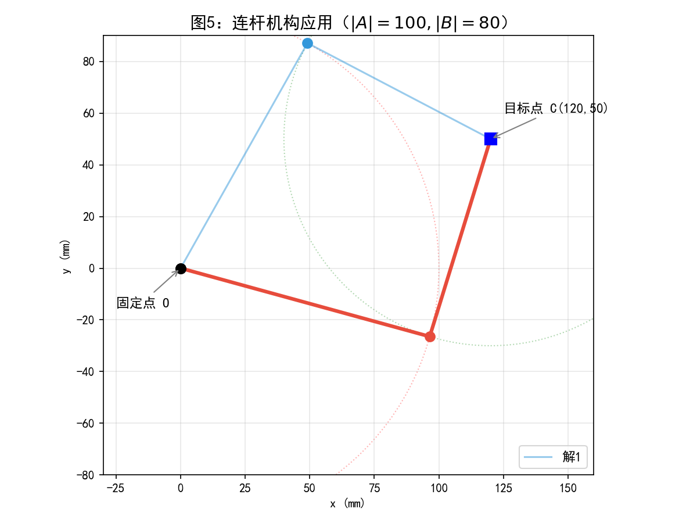

# 矢量分解算法详解

> **源文件**：`vector_decomposition.py`
> **核心功能**：已知 $\vec{C}$ 的坐标和 $\vec{A}$、$\vec{B}$ 的长度，求解满足 $\vec{C} = \vec{A} + \vec{B}$ 的 $\vec{A}$ 和 $\vec{B}$ 的角度。

---

## 1. 问题描述

在二维笛卡尔平面中，给定：

| 已知量 | 说明 |
|--------|------|
| $\|\vec{A}\| = a$ | 矢量 $\vec{A}$ 的长度 |
| $\|\vec{B}\| = b$ | 矢量 $\vec{B}$ 的长度 |
| $\vec{C} = (c_x, c_y)$ | 矢量 $\vec{C}$ 的完整坐标 |

**求解** $\vec{A}$ 和 $\vec{B}$ 的方向角 $\theta_A$ 和 $\theta_B$（单位：度），使得：

$$\vec{C} = \vec{A} + \vec{B}$$



---

## 2. 数学推导

### 2.1 矢量加法与三角形法则

当 $\vec{C} = \vec{A} + \vec{B}$ 时，三个矢量首尾相接构成三角形 $\triangle OPQ$：

- 从原点 $O$ 沿 $\vec{A}$ 到达点 $P$
- 从点 $P$ 沿 $\vec{B}$ 到达点 $Q$
- $OQ$ 即为 $\vec{C}$

改写为：$\vec{B} = \vec{C} - \vec{A}$



### 2.2 余弦定理求解

在 $\triangle OPQ$ 中，三边分别为 $|\vec{A}|$、$|\vec{B}|$、$|\vec{C}|$。由余弦定理：

$$|\vec{B}|^2 = |\vec{A}|^2 + |\vec{C}|^2 - 2|\vec{A}||\vec{C}|\cos\alpha$$

其中 $\alpha = |\theta_C - \theta_A|$，解出 $\cos\alpha$：

$$\cos\alpha = \frac{|\vec{C}|^2 + |\vec{A}|^2 - |\vec{B}|^2}{2|\vec{A}||\vec{C}|}$$

$\vec{C}$ 的角度由坐标直接求出：

$$\theta_C = \arctan\!\left(\frac{c_y}{c_x}\right)$$

求出 $\alpha = \arccos(\cos\alpha)$ 后，得到 $\theta_A$ 的**两个候选解**：

$$\theta_{A,1} = \theta_C - \alpha, \qquad \theta_{A,2} = \theta_C + \alpha$$

对每个 $\theta_A$，通过矢量减法得到 $\vec{B}$ 再求 $\theta_B$：

$$\vec{B} = (c_x - a\cos\theta_A,\; c_y - a\sin\theta_A), \quad \theta_B = \arctan\!\left(\frac{b_y}{b_x}\right)$$



### 2.3 三角形不等式（可解性约束）

$\arccos(\cos\alpha)$ 有实数解的充要条件：

$$||\vec{A}| - |\vec{B}|| \leq |\vec{C}| \leq |\vec{A}| + |\vec{B}|$$

| 条件 | 解的个数 | 几何含义 |
|------|---------|---------|
| $\|\vec{A}\| - \|\vec{B}\| < \|\vec{C}\| < \|\vec{A}\| + \|\vec{B}\|$ | 2 个解 | 一般三角形 |
| $\|\vec{C}\| = \|\vec{A}\| + \|\vec{B}\|$ 或 $\|\vec{C}\| = \|\vec{A}\| - \|\vec{B}\|$ | 1 个解 | 退化三角形（共线） |
| 不满足上述条件 | 无解 | 无法构成三角形 |



### 2.4 解的选择（`solution` 参数）

代码使用 `cal_angle_diff` 计算归一化角度差 $\Delta\theta = \theta_B - \theta_A$（范围 $(-180°, 180°]$），等价于：

$$\text{diff} = ((\theta_B - \theta_A + 540°) \bmod 360°) - 180°$$

- **`solution = 0`**：选择 $\Delta\theta \geq 0$（$\theta_A \leq \theta_B$）的解
- **`solution = 1`**：选择 $\Delta\theta < 0$（$\theta_A > \theta_B$）的解

---

## 3. 算法流程

```
输入: len_a, len_b, c_x, c_y, solution
  │
  ├─ 1. 参数验证（长度 > 0，solution ∈ {0,1}）
  │
  ├─ 2. |C| = 0 → 若 |A|=|B| 返回 (0°,180°) 或 (180°,0°)；否则报错
  │
  ├─ 3. θ_C = atan2(c_y, c_x)
  │
  ├─ 4. cos(α) = (|C|² + |A|² - |B|²) / (2|A||C|)
  │     └─ 钳位到 [-1, 1]，不满足则抛出异常
  │
  ├─ 5. α = arccos(cos(α))
  │
  ├─ 6. 两组候选解：
  │     θ_A1 = θ_C − α,  θ_B1 = atan2(c_y − a·sin(θ_A1), c_x − a·cos(θ_A1))
  │     θ_A2 = θ_C + α,  θ_B2 = atan2(c_y − a·sin(θ_A2), c_x − a·cos(θ_A2))
  │
  ├─ 7. 角度转度数 [0°, 360)
  │
  └─ 8. 根据 solution 参数选择并返回 (angle_a, angle_b)
```

---

## 4. 特殊情况



| 情况 | 条件 | 结果 |
|------|------|------|
| 零矢量 $\vec{C}=\vec{0}$ | $\|\vec{A}\| = \|\vec{B}\|$ | $\theta_A = 0°, \theta_B = 180°$（或反之） |
| 零矢量 $\vec{C}=\vec{0}$ | $\|\vec{A}\| \neq \|\vec{B}\|$ | 无解 |
| 共线同向 | $\alpha = 0°$ | $\theta_A = \theta_B = \theta_C$ |
| 等腰对称 | $\|\vec{A}\| = \|\vec{B}\|$ | $\vec{A}$ 和 $\vec{B}$ 关于 $\vec{C}$ 对称 |

---

## 5. 应用示例

### 连杆机构逆运动学

在平面连杆机构中，已知两连杆长度和末端目标位置，反算关节角度：



```
连杆 |A| = 100mm, 连杆 |B| = 80mm, 目标 C = (120, 50)
解0（红色实线）：连杆A向上偏转
解1（蓝色虚线）：连杆A向下偏转
```

### 数值验证

以 `|A|=5, |B|=7, C=(6,8)` 为例：

```
|C| = √(36+64) = 10
cos(α) = (100+25-49)/(2×5×10) = 76/100 = 0.76
α = arccos(0.76) ≈ 40.54°
θ_C = arctan(8/6) ≈ 53.13°

解0：θ_A = 53.13° − 40.54° = 12.59°,  → 计算得 θ_B ≈ 83.18°
解1：θ_A = 53.13° + 40.54° = 93.67°,  → 计算得 θ_B ≈ −19.44°
```

验证：$\vec{A} + \vec{B} = (3.991, 3.026) + (2.009, 4.974) = (6.000, 8.000)$ ✓

---

## 6. 总结

| 特性 | 说明 |
|------|------|
| **算法核心** | 余弦定理求解矢量三角形 |
| **复杂度** | $O(1)$，纯数学运算 |
| **解的个数** | 最多 2 组，最少 0 组 |
| **关键约束** | 三角形不等式 |
| **数值稳定** | $10^{-10}$ 容差处理浮点误差 |
| **典型应用** | 连杆机构逆运动学、力的分解、速度/加速度合成 |
