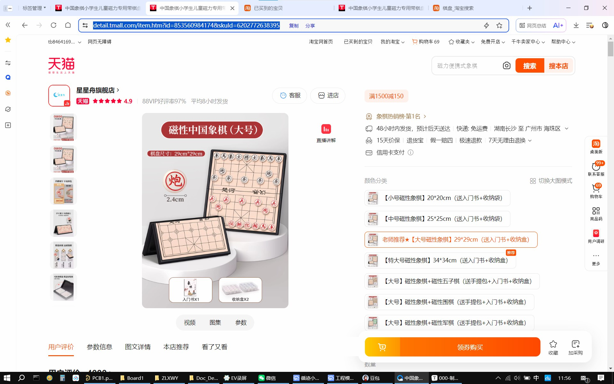
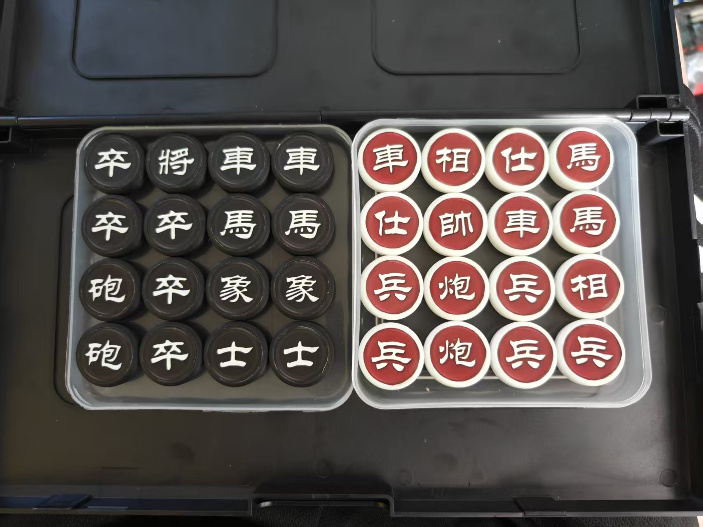
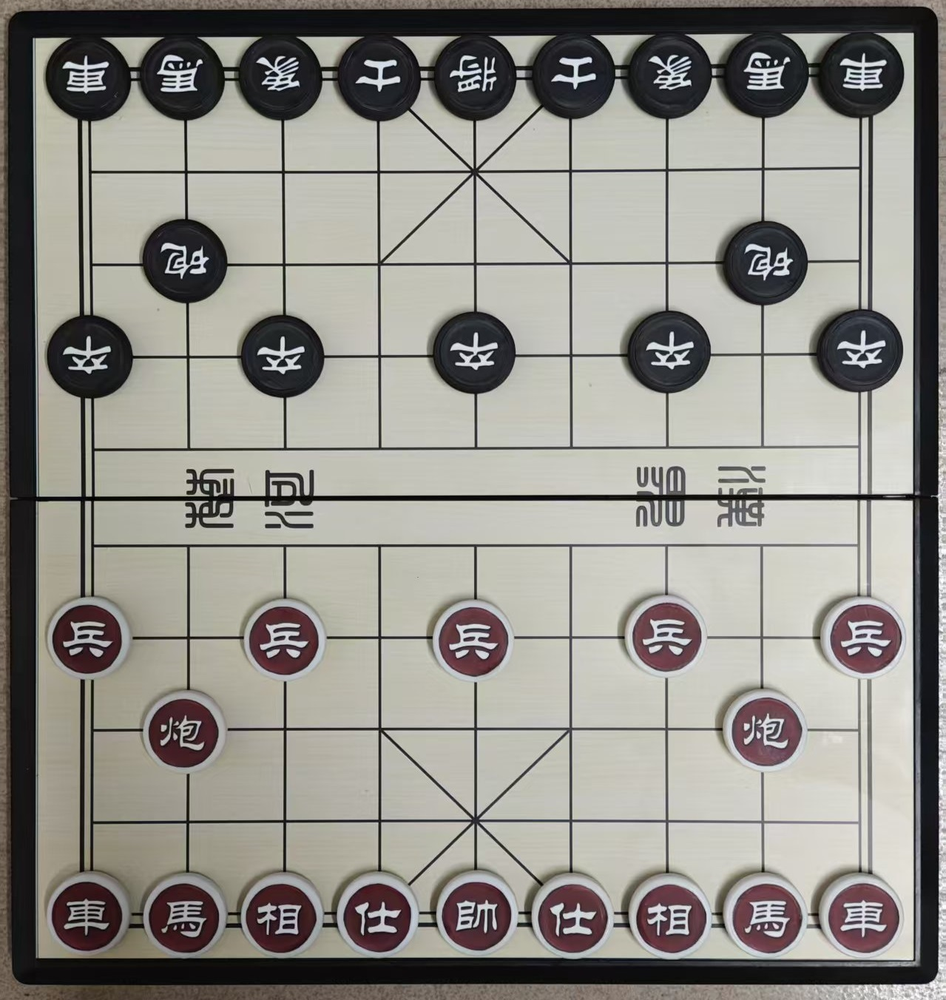
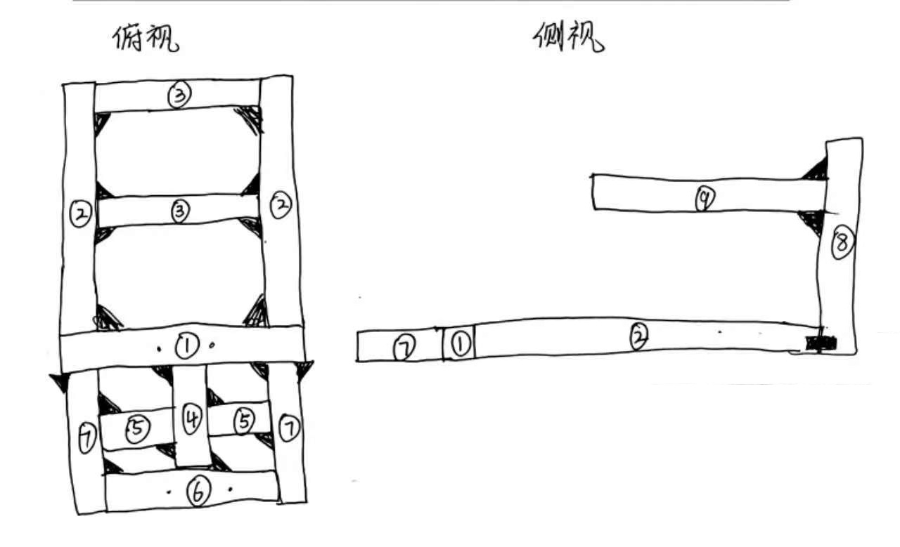

[TOC]

## 物件

### 1. 中国象棋棋盘

购买链接：https://detail.tmall.com/item.htm?id=853560984174&skuId=6202772638395

### 2. 棋子

| 物件 | 参数 | 数量 | 购置链接推荐 |
| --- | --- | --- | --- |
| 棋子模型 | 模型文件见 *Model_ChineseChess/棋子模型.SLDPRT* | 白色 32 个 （多打印几个备用） | [嘉立创3D打印在线报价](https://www.jlc-3dp.cn/placeOrder?spm=3D.Homepage.instantquote1) |
| 铁块 | 圆柱形，直径 18mm 高 6mm 可被磁石吸附 | 需要 32 个 （多准备增加冗余） | [淘宝-中钢金属物资](https://shop596005788.taobao.com/) |
| 棋子贴纸 | 图片见 *Model_ChineseChess/棋子贴纸.jpg* 尺寸要求：长 214.58mm，宽 51.50mm 材质要求：不透明、哑光、印刷色彩鲜艳、不易磨色（合成纸、表面覆哑光膜） 撕出要求：注意不要撕进阴影部分 |需要 2 张 （多打印几张）| [闲鱼-乐逸印务](https://www.goofish.com/item?id=996490925570) [淘宝-印设旗舰店](https://detail.tmall.com/item.htm?id=674422129315) |

### 3. 机械臂

机械臂是一整个购买B站的一个UP主制作的，以下是这个UP的视频
- [Bilibili-【第三代】SCARA 3D打印机械臂](https://www.bilibili.com/video/BV14h9jYNExY)
- [Bilibili-SCARA三轴机械臂，写新年祝福语了](https://www.bilibili.com/video/BV1aNvvBzEr9)

### 4. 底板PCB

见嘉立创EDA绘制的PCB文件 *PCB/底板.eprj2* ，BOM 如下：

| 简介 | 物品信息 | 数量 | 购置链接推荐 |
| --- | --- | --- | --- |
| 稳压芯片 | TO220-L7805CV | 1 | https://item.taobao.com/item.htm?id=653242149759 |
| 散热片 | TO220封装芯片散热片 | 1 | https://item.taobao.com/item.htm?id=562635952158&skuId=5016311834016 |
| 电机驱动芯片 | L298N+散热片 | 1 | https://item.taobao.com/item.htm?id=650714392966&skuId=4713871520670 |
| 稳压模块 | LM2596S-5V稳压模块 | 2 | https://detail.tmall.com/item.htm?id=41307963557&skuId=5352660439882 |
| 开关 | SS12D06-G5 | 1 | https://item.taobao.com/item.htm?id=568771505825&skuId=6130758858580 |
| 排针 | 2.54mm间距排针1\*1p | 8 | https://item.taobao.com/item.htm?id=553875848479&skuId=6138476482150 |
| 二极管 | SMA封装M7二极管 | 8 | https://item.taobao.com/item.htm?id=545440281632 |
| 电容 | 10μF-耐压50V-0805贴片陶瓷电容 | 1 |
| 电容 | 330nF-耐压50V-0805贴片陶瓷电容 | 1 |
| 电容 | 100nF-耐压50V-0805贴片陶瓷电容 | 1 |
| 电容 | 220uF-耐压35V-D8\*H10.5贴片电解电容 | 1 |
| 插座 | DC005-DC5525电源插座 | 1 | https://item.taobao.com/item.htm?id=556796729366&skuId=6130630902911 |
| 插座 | XT60PW-M电源插座 | 1 | https://item.taobao.com/item.htm?id=599064876282&skuId=4354073123814 |
| 插座 | XH2.54-2P插座 | 5 | https://item.taobao.com/item.htm?id=522555535449&skuId=5777387544669 |
| 插座 | XH2.54-4P插座 | 7 | https://item.taobao.com/item.htm?id=522555535449&skuId=5777387544671 |
| 插座 | XH2.54-10P插座 | 4 | https://item.taobao.com/item.htm?id=522555535449&skuId=5777387544677 |
| 插座 | USB-2.0双层插座 | 1 | https://item.taobao.com/item.htm?id=556824962771&skuId=5770936937543 |

### 4. 步进电机驱动器
[淘宝-亿星科技步进伺服控制系统厂家-42/57步进电机驱动器TB6600升级版](https://item.taobao.com/item.htm?id=45257012832&skuId=4473671716068)

### 5. 控制器
[淘宝-桔恩迪电子-STM32F407ZGT6最小系统板](https://item.taobao.com/item.htm?id=767987284614&skuId=5296354469386)

### 6. 主控制器
[淘宝-轮趣科技-地瓜派RDKX5大算力开发板](https://item.taobao.com/item.htm?id=676436236906&skuId=5636246789347)

### 7. 铝型材框架

| 简介 | 物品信息 | 数量 | 购置链接推荐 |
| --- | --- | --- | --- |
| 铝型材 | 欧标2020L-1.5铝型材304mm (1) | 1 | https://shop243600854.taobao.com/ |
| 铝型材 | 欧标2020L-1.5铝型材315mm (2) | 2 | https://shop243600854.taobao.com/ |
| 铝型材 | 欧标2020L-1.5铝型材264mm (3) | 2 | https://shop243600854.taobao.com/ |
| 铝型材 | 欧标2020L-1.5铝型材79mm (4) | 1 | https://shop243600854.taobao.com/ |
| 铝型材 | 欧标2020L-1.5铝型材56mm (5) | 2 | https://shop243600854.taobao.com/ |
| 铝型材 | 欧标2020L-1.5铝型材132mm (6) | 1 | https://shop243600854.taobao.com/ |
| 铝型材 | 欧标2020L-1.5铝型材99mm (7) | 2 | https://shop243600854.taobao.com/ |
| 铝型材 | 欧标2020L-1.5铝型材450mm (8) | 1 | https://shop243600854.taobao.com/ |
| 铝型材 | 欧标2020L-1.5铝型材186mm (9) | 1 | https://shop243600854.taobao.com/ |
| 铝型材紧固件 | 欧标2020角码 | 20 | https://shop243600854.taobao.com/ |
| 铝型材紧固件 | 欧标2020转向角件 | 2 | https://shop243600854.taobao.com/ |
| 铝型材紧固件 | 欧标2020-L型连接板 | 2 | https://shop243600854.taobao.com/ |
| 盖板 | 亚克力板152×335×3(mm) | 2 | https://shop243600854.taobao.com/ |
| 紧固件 | 欧标2020-M3滑块螺母 | 16 | https://shop243600854.taobao.com/ |
| 紧固件 | 304内六角沉头螺丝 | 16 | https://detail.tmall.com/item.htm?id=635419852142&skuId=4556296081870 |

### 8. 接线端子