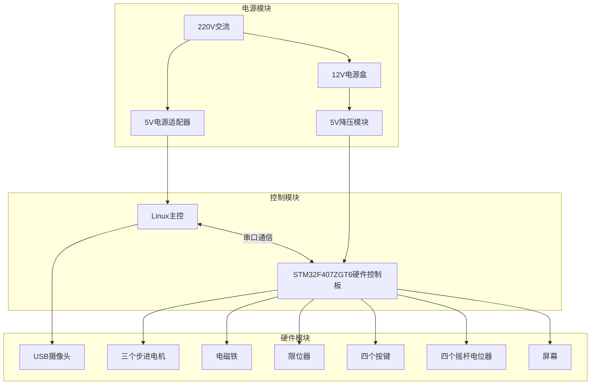
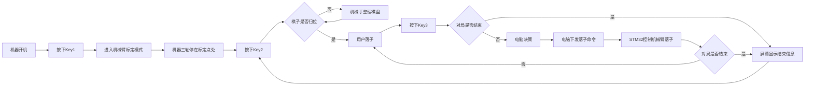
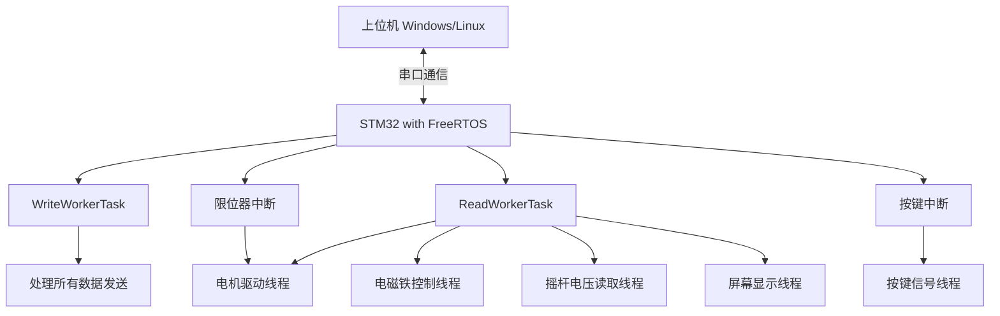

## 框图

## 硬件模块
- 电源模块
  - 220V交流电
  - 5V电源适配器
  - 12V电源盒
  - 5V降压模块
- 控制模块

## 暴露给用户的外部操作元素
- 按键4个，分别用Key0、Key1、Key2、Key3表示
  - Key0 - 显示/隐藏棋盘锚定框
  - Key1 - 进入机械臂标定模式
  - Key2 - 进入整理模式
  - Key3 - 用户落子完成
- 屏幕1个

## 流程文字描述
1. 电脑处于**待机模式**
2. 按下**Key0**在画面上显示棋盘锚定框，统一棋盘安装位置（此操作不切换模式，只是单纯在画面显示锚定框）
3. 用户按下**Key1**，电脑进入**机械臂标定模式**，将会通过摄像头对准机械臂末端和画面的标定点，并将竖轴复位
4. 机械臂末端标定完成后，电脑回归**待机模式**，此时机械臂停在标定点处
5. 用户按下**Key0**，隐藏棋盘锚定框
6. 象棋随意在棋盘上摆放，正面朝上，32个棋子，无缺失
7. 用户按下**Key2**，进入**整理模式**，机械臂开始整理棋盘，用户执红，电脑执黑，直至所有棋子归位
8. 整理完成后，机械臂回归**待机模式**，此时机械臂停在右手待机处
9. 然后进入对弈模式，默认用户红方先手
10. 用户落子后（如有吃子，则放至其右手边吃子盒再落子），然后按下**Key3**，轮到电脑落子
11. 电脑通过摄像头检测局势变化，计算出走法并落子（如有吃子，则放至其右手边吃子盒再落子），回位右手待机处
12. 以上两步一直循环
13. 当对局结束，在屏幕上显示结果：红/黑方获胜、红/黑方被绝杀
14. 电脑回到待机模式

> 更好看的流程图运行 [draw_flowchart](./.003_机器流程_assets/draw_flowchart.py) 查看

## 下位机程序结构

