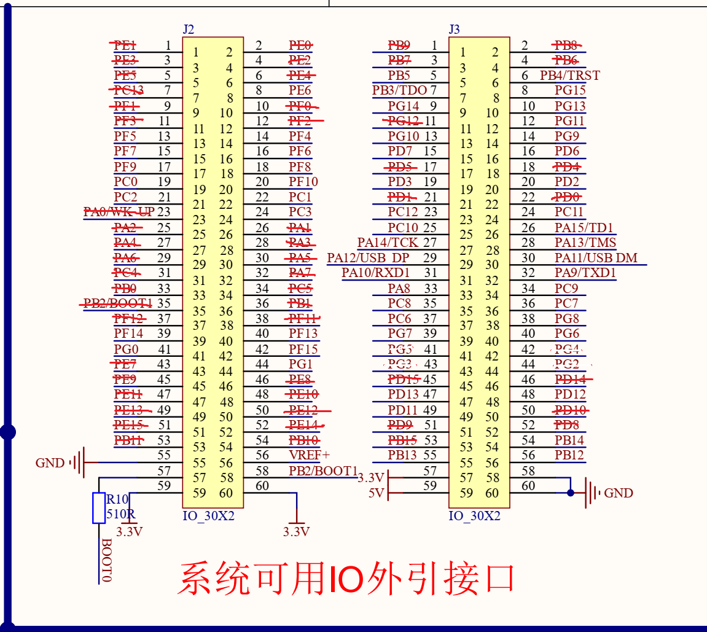

## 串口通信

| 引脚 | 外设功能 | 连接设备 | 作用 |
| --- | --- | --- | --- |
| PB10 | USART3_TX | MasterControl_RXD | 与上位机串口通信 |
| PB11 | USART3_RX | MasterControl_TXD | 与上位机串口通信 |

## 电机驱动L298N

| 引脚 | 外设功能 | 连接设备 | 作用 |
| --- | --- | --- | --- |
| PA5 | TIM2_CH1 | L298N_ENA | 控制电磁铁使能 |
| PA4 | GPIO_Output | L298N_IN1 | 控制电磁铁通电方向 |
| PA7 | GPIO_Output | L298N_IN2 | 控制电磁铁通电方向 |
| PA6 | TIM3_CH1 | L298N_ENB | 待定 |
| PC4 | GPIO_Output | L298N_IN3 | 控制电磁铁通电方向 |
| PC5 | GPIO_Output | L298N_IN4 | 控制电磁铁通电方向 |

## 屏幕

| 引脚 | 外设功能 | 连接设备 | 作用 |
| --- | --- | --- | --- |
| NRST | Reset | LCD_RST | LCD复位 |
| PB15 | GPIO_Output | LCD_BL | LCD背光 |
| PD14 | FSMC_D0 | LCD_FSMC_D0 | LCD并行接口 |
| PD15 | FSMC_D1  | LCD_FSMC_D1 | LCD并行接口 |
| PD0 | FSMC_D2 | LCD_FSMC_D2 | LCD并行接口 |
| PD1 | FSMC_D3 | LCD_FSMC_D3 | LCD并行接口 |
| PE7 | FSMC_D4 | LCD_FSMC_D4 | LCD并行接口 |
| PE8 | FSMC_D5 | LCD_FSMC_D5 | LCD并行接口 |
| PE9 | FSMC_D6 | LCD_FSMC_D6 | LCD并行接口 |
| PE10 | FSMC_D7 | LCD_FSMC_D7 | LCD并行接口 |
| PE11 | FSMC_D8 | LCD_FSMC_D8 | LCD并行接口 |
| PE12 | FSMC_D9 | LCD_FSMC_D9 | LCD并行接口 |
| PE13 | FSMC_D10 | LCD_FSMC_D10 | LCD并行接口 |
| PE14 | FSMC_D11 | LCD_FSMC_D11 | LCD并行接口 |
| PE15 | FSMC_D12 | LCD_FSMC_D12 | LCD并行接口 |
| PD8 | FSMC_D13 | LCD_FSMC_D13 | LCD并行接口 |
| PD9 | FSMC_D14 | LCD_FSMC_D14 | LCD并行接口 |
| PD10 | FSMC_D15 | LCD_FSMC_D15 | LCD并行接口 |
| PD4 | FSMC_NOE | LCD_FSMC_NOE | LCD读使能 |
| PD5 | FSMC_NWE | LCD_FSMC_NWE | LCD写使能 |
| PF12 | FSMC_A6 | LCD_FSMC_A6 | LCD地址线 |
| PG12 | FSMC_NE4 | LCD_FSMC_NE4 | LCD片选线 |
| PB0 | GPIO_Output  | LCD_TOUCH_SCK | LCD触摸屏时钟线 |
| PC13 | GPIO_Output  | LCD_TOUCH_CS | LCD触摸屏片选线 |
| PF11 | GPIO_Output  | LCD_TOUCH_MOSI | LCD触摸屏主发从收数据线 |
| PB2 | GPIO_Input  | LCD_TOUCH_MISO | LCD触摸屏主收从发数据线 |
| PB1 | GPIO_Input  | LCD_TOUCH_PEN | LCD触摸屏触摸中断引脚 |

## 步进电机驱动

| 引脚 | 外设功能 | 连接设备 | 作用 |
| --- | --- | --- | --- |
| PE4 | GPIO_Output | ShoulderStepperMotor_Dir | 肩关节电机方向信号 |
| PE5 | TIM9_CH1 | ShoulderStepperMotor_Pul | 肩关节电机脉冲信号 |
| PB6 | GPIO_Output | ElbowStepperMotor_Dir | 肘关节电机方向信号 |
| PB8 | TIM10_CH1 | ElbowStepperMotor_Pul | 肘关节电机脉冲信号 |
| PB7 | GPIO_Output | LiftStepperMotor_Dir | 竖轴电机方向信号 |
| PB9 | TIM11_CH1 | LiftStepperMotor_Pul | 竖轴电机脉冲信号 |

## 12V限位器

| 引脚 | 外设功能 | 连接设备 | 作用 |
| --- | --- | --- | --- |
| PE0 | GPIO_Input | SIG0 | 待定 |
| PE1 | GPIO_Input | SIG1 | 待定 |
| PE2 | GPIO_Input | SIG2 | 竖轴原点限位器 |
| PE3 | GPIO_Input | SIG3 | 待定 |

## 按键

| 引脚 | 外设功能 | 连接设备 | 作用 |
| --- | --- | --- | --- |
| PF0 | GPIO_Input | KEY0 | 按键0 |
| PF1 | GPIO_Input | KEY1 | 按键1 |
| PF2 | GPIO_Input | KEY2 | 按键2 |
| PF3 | GPIO_Input | KEY3 | 按键3 |

## 摇杆

| 引脚 | 外设功能 | 连接设备 | 作用 |
| --- | --- | --- | --- |
| PA0 | ADC1_IN0 | 左摇杆上下方向 | 读取摇杆电位值 |
| PA1 | ADC1_IN1 | 左摇杆左右方向 | 读取摇杆电位值 |
| PA2 | ADC1_IN2 | 右摇杆上下方向 | 读取摇杆电位值 |
| PA3 | ADC1_IN3 | 右摇杆左右方向 | 读取摇杆电位值 |

